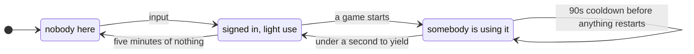

# offpeak

**A gaming PC is idle most of the day. Put those hours to work — and hand the
machine back the instant its owner wants it.**

One 127 KB executable watches the machine and lends out what nobody is using.
Not the graphics card alone: a game takes the GPU and leaves twelve threads
doing nothing, and a compile takes every thread and leaves the card at five per
cent. So the card, the processor and the memory are given up separately, on
five machine states that are each decidable from a signal that exists.

When somebody starts a game it stops, in well under a second, and does not come
back for a minute and a half.

There is no central server, no account and no broker. The machine listens on
your own network and you talk to it directly.

```
offpeak service install echo        # 21 MB, no GPU needed, proves the whole path
offpeak submit echo --body-file job.json --wait
offpeak limits                      # what this machine is giving up right now
```

> **Windows and NVIDIA only.** The detection is `nvidia-smi` plus Windows
> performance counters, and it depends on details of the WDDM display driver
> model. There is no Linux or AMD path and none is planned. This is a boundary,
> not a gap.

> **It was called `idlegpu`.** It stopped being only about the GPU when it
> learned to lend the processor and the memory as well. `install.ps1` retires
> the old scheduled task and Startup shortcuts, so an upgrade does not leave
> two agents fighting over one port.

---

## What it gives up, and when

Five states, each decidable from a signal that exists — not a list of
executable names, which is what every other project does and what breaks the
moment somebody renames a binary.

| The machine is | which means | and the defaults give up |
|---|---|---|
| Nobody signed in | no console user at all | everything |
| Signed in, locked | nobody is at the keyboard | everything, at below-normal priority |
| Signed in, idle | no input for five minutes | the GPU, and half the CPU |
| Signed in, light use | reading, typing, a browser | the GPU, and a tenth of the CPU |
| Somebody is using it | a game exists, or somebody else's work is on the CPU | nothing |



The card and the processor are separate because the load is: a game takes the
GPU and leaves twelve threads doing nothing, and a compile takes every thread
and leaves the card at five per cent.

**How it decides, and every measurement behind it:
[docs/INTERNALS.md](docs/INTERNALS.md).**

## What this actually is

Three pieces that are useful separately and only interesting together:

1. **A policy that can tell whether somebody is using a GPU.** This is the part
   with no off-the-shelf equivalent. Every distributed computing project has
   something like it and every one of them is a list of executable names. This
   one is a ladder of signals with a measured idle baseline behind each
   threshold, and 172 tests over recorded samples.
2. **A generic work runner.** A service is a process the agent supervises inside
   a Windows job object plus a queue that is a directory. The runner never parses
   a job or opens an artefact. It has no word for audio, images or hashes.
3. **A TLS listener and a CLI**, so you can talk to the machine directly. There
   is no central server, and none is required.

One runner hosts many services. Speech is one. Image generation is another. A
long password-recovery run is another. See
[docs/ADDING-A-SERVICE.md](docs/ADDING-A-SERVICE.md).

**The one promise that outranks everything: the machine belongs to somebody who
plays games on it, and they have absolute priority.** Every design decision below
that conflicts with that decision loses.

---

## Install

Needs Windows, an NVIDIA GPU, and .NET Framework 4.8 — which is **already part of
Windows**. There is no SDK to install, no NuGet restore, and no network access
required to build: the C# compiler ships inside the operating system.

```powershell
git clone <this repo>
cd offpeak
powershell -ExecutionPolicy Bypass -File build.ps1
powershell -ExecutionPolicy Bypass -File install.ps1
```

That copies 426 KB into `%LOCALAPPDATA%\offpeak` and puts a shortcut in your
Startup folder. It downloads nothing.

### Start in `Off` mode for a week

This is the recommended first step and it costs you nothing.

```ini
StartMode = Off
```

In `Off` the agent watches, evaluates the policy and logs every verdict, and
**never takes the GPU**. Play for a week, then read `worker.log`. If it never
said `available` while you were playing, its opinions are worth trusting. If it
did, you have found a threshold to change before it could cost you a match.

### Then install a service

```powershell
offpeak service install echo        # 21.5 MiB, needs no GPU
offpeak service list
```

`echo` exists so you can exercise the entire path — submit, schedule, run, yield,
artefact — before spending six gigabytes finding out whether speech works. The
expensive part of this system is not the part most likely to be wrong.

---

## The API

`https://127.0.0.1:47600` by default. Real HTTP/1.1, so `curl` works.

| | |
|---|---|
| `GET /healthz` | loopback, no auth. Is the agent up, is a controller alive |
| `GET /v1/status` | the published snapshot: mode, state, seconds until available, the GPU sample |
| `GET /v1/services` | every known service, its three states, its labels and the manifest its controller published |
| `POST /v1/services/{id}/jobs` | submit. Body is service-defined JSON. `Idempotency-Key` honoured |
| `GET /v1/services/{id}/jobs/{job}` | queued / running / done / failed / cancelled |
| `GET /v1/services/{id}/jobs/{job}/result` | stream the artefact bytes |
| `DELETE /v1/services/{id}/jobs/{job}` | withdraw it, or ask the controller to stop |
| `HEAD /v1/assets/{sha256}` | do you already hold this blob |
| `POST /v1/assets` | upload a blob, get its sha256 back |
| `POST /v1/mode` | `Auto` \| `AlwaysOn` \| `Off` |

`GET /v1/services/{id}/jobs/{job}/events` answers **501 with a sentence telling
you to poll**, rather than 404. A 404 sends you looking for a typo.

### Idempotency is not optional

A yield is the **normal** case, not an error. When the owner comes back mid-job
the lease goes back to `pending` and the job reports `queued` again, and a client
will retry. `Idempotency-Key` is what makes that a retry rather than a second
run — which, for a speech service, is the difference between one sentence and the
same sentence spoken twice.

### The CLI

First class, because some services are command lines by nature.

```
offpeak status
offpeak services
offpeak submit hashcat -- -m 22000 hash.hc22000 rockyou.txt
offpeak watch hashcat <job>
offpeak result hashcat <job> -o cracked.txt
offpeak mode Off
offpeak fingerprint
```

Everything after `--` becomes `{"argv": [...]}` and is handed to the controller
verbatim. The runner never learns what `-m 22000` means.

Connect to another machine with `--host`, `--port`, `--fingerprint` and
`--key-file`.

> **PowerShell strips double quotes** when it passes an argument to a native
> program, so `--body '{"a":1}'` arrives as `{a:1}`. The client checks the JSON
> before it sends and says so; use `--body-file` for anything non-trivial.

---

## Who uses this

[Calliope](https://github.com/gabrielbelli/calliope) is a self-hosted speech
stack that runs on a NAS with no GPU. Its long-form voice cloning needs one,
so it borrows this machine's: the `chatterbox` and `chatterbox-turbo` services
in `worker.ini` are what it submits to.

It is a fair test of the promise, because the two sides want opposite things.
Calliope wants the card; the person at the keyboard wants to play a game. The
runner answers `can_run` before every job and yields mid-job when the answer
changes, so a long document being read aloud pauses rather than competing, and
the stack reports the pause instead of failing the job.

Nothing about that is specific to speech. The runner never parses a job, never
opens an artefact, and has no word for audio.

## Adding a service

**One INI section and one controller script. No C# is recompiled and no part of
the protocol changes.** Full guide, with worked Hashcat and Stable Diffusion
shapes: [docs/ADDING-A-SERVICE.md](docs/ADDING-A-SERVICE.md).

The whole inter-process protocol is filenames:

```
<QueueDir>/pending/<job>.json      the agent wrote a lease. Work to do.
<QueueDir>/working/<job>.json      the controller claimed it, by rename.
<QueueDir>/done/<job>.done.json    the controller finished it.
<QueueDir>/done/<job>.<anything>   an artefact. Bytes. The agent never opens it.
<QueueDir>/service.json            the manifest, written by the controller.
```

There is no socket between the agent and a controller, no JSON parser in the
agent, and no library to link. A controller is any program that can list a
directory, rename a file and read one line from standard input. The status is in
the **file name** so that a directory listing answers "is this done".

`YIELD` arrives on standard input. **EOF also means yield**, which gives a dead
man's switch for free: if the agent dies for any reason the kernel closes the
pipe and the controller exits on its own rather than becoming an orphan holding a
CUDA context.

---

## Nothing is installed until you ask

**The base install downloads nothing.** It is the agent, the tray, the listener,
the CLI and the policy, and that is all. A machine whose owner never wanted
speech never sees a byte of torch.

A service is opted into explicitly, and only then does it fetch anything:

```
offpeak service list                 # what this build knows about, and what each costs
offpeak service install chatterbox   # NOW it downloads
offpeak service cost                 # what each one is actually using, measured
offpeak service disable chatterbox   # stop running it, keep it on disk
offpeak service remove chatterbox    # delete it and reclaim the disk
```

Where two services share one install directory - a second checkpoint for a model
family that is already there - removing either leaves the tree alone and clears
only its own ready marker. `offpeak service remove <id> --purge` deletes the tree,
and refuses until every service sharing it has been removed.

### Three states, never conflated

This distinction is the reason the API exists in the shape it does.

| state | meaning | whose problem |
|---|---|---|
| **known** | there is a section for it in `worker.ini`. Nothing downloaded, nothing running. | the owner's, and it takes one command |
| **installed** | provisioning finished and left its marker. Real disk committed. | — |
| **ready** | installed *and* enabled. The scheduler will run it. | — |

and, separately and orthogonally, because it is a property of the **machine** and
not of any service:

| | |
|---|---|
| **gpu_available** | is the GPU free right now | nobody's, and it clears on its own |

A client asking "can you speak for me" must be able to tell *"no, speech is not
installed on this runner"* from *"no, somebody is playing a game"*. The first is
a five-minute fix by the machine's owner. The second is nobody's to fix and will
resolve itself. A client that cannot tell them apart retries for ever against a
runner that was never going to say yes.

`GET /v1/services` reports all four separately and never merges them.

---

## Exposing it to a LAN, and the one admin click

**Loopback by default.** That is a decision, not timidity, and this is the
paragraph to read before changing it.

A non-elevated process can bind `0.0.0.0` with no reservation — measured, it
gets `LISTENING`. What it **cannot** do is open the Windows Firewall.
`New-NetFirewallRule` returns "Cannot connect to CIM server. Access denied" and
`netsh advfirewall` returns "The requested operation requires elevation".
Measured from another machine on the same LAN, every connection to that listening
socket failed silently, with no rule created and no prompt shown.

Worse, from Microsoft's own documentation: **if a user without administrator
rights is prompted, a BLOCK rule is created whatever they click**, and if
notifications are off there is no prompt at all. That failure is permanent and
silent, and no amount of reading this agent's log will explain it.

So:

- **Loopback needs no firewall rule and works over SSH immediately.** This is the
  path to prefer:
  ```bash
  ssh -N -L 47600:127.0.0.1:47600 you@thatmachine
  ```
- **A LAN bind needs one administrator click, once.** Set `Bind = 0.0.0.0`, and
  the agent then **refuses to start** unless you have also set an `ApiKeyFile`
  and an `AllowedCidrs` allowlist. An operator who exposes a socket and forgets
  the token has made a mistake nothing else will make them notice, because it
  will appear to work.

Authentication is two independent checks, both before any lease is written: the
pinned certificate, and a bearer token compared in constant time. Loopback may
run tokenless, the way BOINC's GUI RPC does, because reaching `127.0.0.1` already
means code execution on the machine.

---

## Uninstall

```powershell
Remove-Item "$([Environment]::GetFolderPath('Startup'))\offpeak.lnk"
Remove-Item -Recurse -Force "$env:LOCALAPPDATA\offpeak"
```

That is everything, including every gigabyte any service downloaded. Add
`Remove-ItemProperty HKCU:\Software\Microsoft\Windows\CurrentVersion\Run offpeak`
if you installed with `-UseRunKey`, and remove the inbound firewall rule if you
ever created one.

> If you installed a service before this note existed, check for
> `%USERPROFILE%\.pkuseg` and delete it. One chatterbox dependency built that
> path in code rather than reading a variable, so it escaped the contained
> directory and survived `service remove`. Installs from here point the child's
> home directory inside the install, which closes it.

To reclaim a service's disk without uninstalling:

```powershell
offpeak service remove chatterbox
```

---

## Licence

BSD 2-Clause. See [LICENSE](LICENSE).

`spring` throughout this document is the machine every measurement was taken
on: a Ryzen with 31.9 GiB of memory and an NVIDIA card, running Windows 11.
A realtime factor or an idle baseline is a property of a machine, so the
machine is named rather than left implied.

